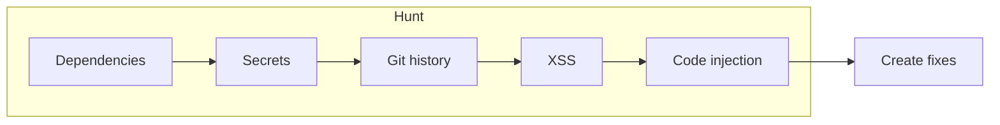
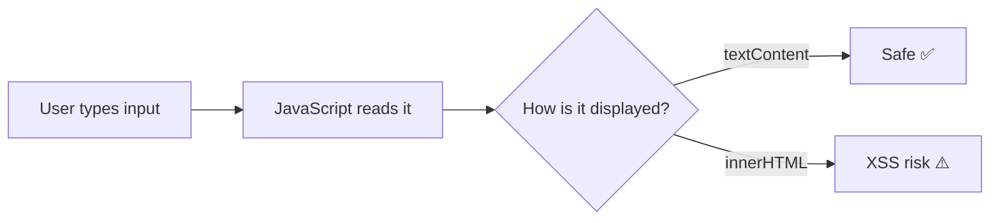
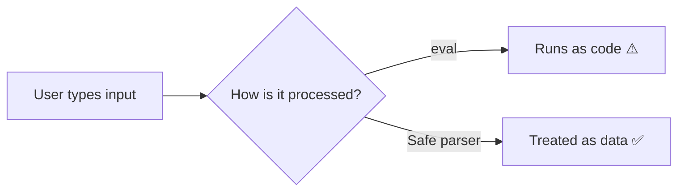

# Field guide: hunting vulnerabilities

Welcome to Security Safari. This guide walks you through hunting for vulnerabilities in a web application. You'll use both manual techniques and AI assistants as "spotters" to find security issues.

## Before you begin

### Set up your environment

```bash
# Clone your repository (GitHub Classroom created it for you)
git clone https://github.com/YOUR-USERNAME/security-safari-YOUR-USERNAME.git
cd security-safari-YOUR-USERNAME

# Install dependencies
npm install

# Start the dev server
npm run dev
```

The app should open in your browser. It's a simple poll application with a calculator feature.

### Deploy to Netlify

Before creating any PRs, deploy your site to Netlify. Use site name: `security-safari-YOUR-USERNAME`

### Your mission

Find **five planted vulnerabilities** in this codebase:

1. An outdated dependency with a known CVE
2. A hardcoded secret in the source code
3. A secret hidden in git history
4. An XSS vulnerability
5. A code injection vulnerability



Document each finding and create fixes.

## Hunt 1: dependency vulnerabilities

**The prey:** Outdated packages with known security issues

**How to track it:**

```bash
npm audit
```

This command checks your `package.json` dependencies against a database of known vulnerabilities.

**What to look for:**

- Severity levels (critical, high, moderate, low)
- CVE numbers (Common Vulnerabilities and Exposures)
- Affected package versions
- Recommended fixes

**Document your finding:**

- What package is vulnerable?
- What is the CVE number?
- What does the vulnerability allow an attacker to do?
- How would you fix it?

## Hunt 2: hardcoded secrets

**The prey:** API keys, passwords, or tokens committed to source code

**How to track it:**

Search the codebase for common secret patterns:

```bash
# Look for common secret variable names
grep -r "API_KEY\|SECRET\|PASSWORD\|TOKEN" src/
```

Or ask your AI spotter (see [SPOTTER-TIPS.md](SPOTTER-TIPS.md)):

> "Search this codebase for hardcoded API keys or secrets"

**What to look for:**

- Strings that look like API keys (long alphanumeric strings)
- Variables named `API_KEY`, `SECRET`, `PASSWORD`, `TOKEN`
- Configuration files with sensitive values

**Document your finding:**

- Where is the secret located?
- What kind of secret is it?
- Why is this dangerous?
- How should secrets be handled instead?

## Hunt 3: secrets in git history

**The prey:** Deleted files that still exist in version control history

Even if a file is deleted, git remembers everything. Attackers know this.

**How to track it:**

```bash
# List all files that have ever existed in the repo
git log --all --full-history -- "*.env"

# Show the contents of a deleted file
git show <commit-hash>:.env
```

Or ask your AI spotter:

> "Check the git history for any deleted files that might contain secrets"

**What to look for:**

- `.env` files that were committed then deleted
- Config files with secrets in older commits
- "Oops" or "remove secret" commit messages

**Document your finding:**

- What file contained the secret?
- What commit added it? What commit "deleted" it?
- How can you still access it?
- How should this have been handled?

## Hunt 4: XSS vulnerabilities

**The prey:** Unsanitized user input rendered as HTML



**How to track it:**

```bash
# Search for innerHTML usage
grep -r "innerHTML" src/
```

Then examine the code to see if user input flows into `innerHTML`.

**Test the vulnerability:**

Try entering this in the poll form:

```html

```

If an alert pops up, you've confirmed the XSS vulnerability.

**Document your finding:**

- What file and line number contains the vulnerability?
- How does user input reach the vulnerable code?
- What could an attacker do with this?
- How would you fix it?

## Hunt 5: code injection

**The prey:** User input passed to `eval()` or similar functions



**How to track it:**

```bash
# Search for eval usage
grep -r "eval(" src/
```

**Test the vulnerability:**

Try entering this in the calculator:

```javascript
alert("Code injection!");
```

Or more dangerously:

```javascript
document.body.innerHTML = "Hacked!";
```

**Document your finding:**

- What file and line number contains the vulnerability?
- What allows the code injection?
- What's the worst an attacker could do?
- How would you fix it safely?

## Writing your report

Create a security audit report with this structure:

```markdown
# Security audit report

## Executive summary

Brief overview of findings

## Findings

### Finding 1: [Title]

- **Severity:** Critical/High/Medium/Low
- **Location:** file:line
- **Description:** What the vulnerability is
- **Impact:** What an attacker could do
- **Recommendation:** How to fix it

[Repeat for each finding]

## Remediation priority

Which fixes are most urgent and why
```

## Next steps

After documenting your findings:

1. Create a branch for your first fix (e.g., `fix/xss-vulnerability`)
2. Fix the vulnerability
3. Open a pull request and merge it
4. Repeat for each vulnerability (5 total PRs)
5. Add security rules to `.github/copilot-instructions.md` based on what you learned
6. Update the README to reflect that vulnerabilities are fixed

See [tutorials/git-workflow.md](../tutorials/git-workflow.md) for the full workflow.

Good hunting!
