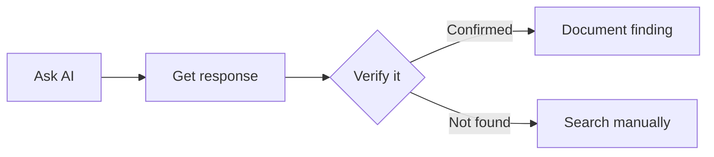
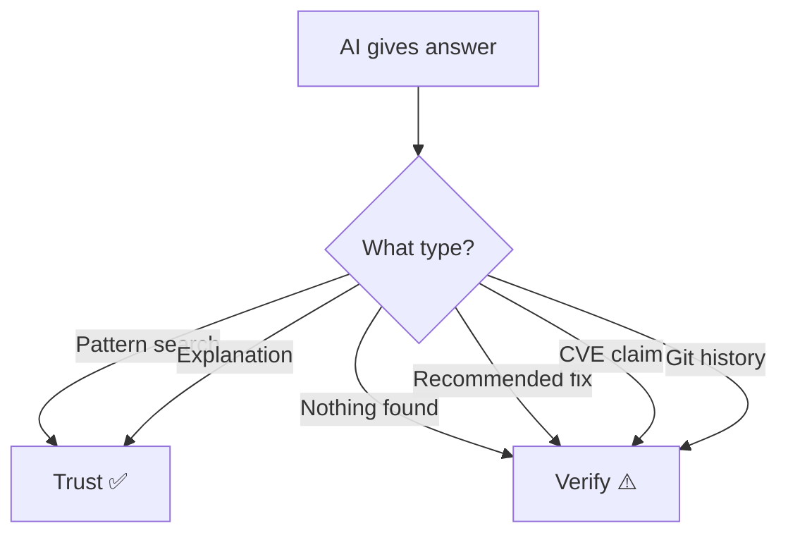

# Spotter tips: AI prompts for security auditing

On a real safari, a spotter helps you find wildlife. In security auditing, an AI assistant can be your spotter - helping you find vulnerabilities faster.

But remember: **spotters can miss things**. You're still the one responsible for the audit.

## How to use AI as a security spotter

### General approach

1. Give the AI context about what you're looking for
2. Ask specific, targeted questions
3. Verify everything the AI tells you
4. Don't assume the AI found everything



### Prompts for common vulnerability hunts

## Dependency checks

Ask your AI spotter:

> "Run npm audit and explain what vulnerabilities were found. Include the CVE numbers and what each vulnerability allows an attacker to do."

> "Check the package.json for any outdated dependencies that might have known security issues."

## Secret scanning

Ask your AI spotter:

> "Search this codebase for hardcoded API keys, passwords, tokens, or other secrets. Check all JavaScript files."

> "Look for strings that match common API key patterns like 'sk_live', 'api_key', or long random-looking strings."

> "Check the git history for any deleted files that might contain secrets. Look for .env files or config files that were added then removed."

## Code review for XSS

Ask your AI spotter:

> "Find all uses of innerHTML in this codebase. For each one, trace where the input comes from and tell me if user input could reach it."

> "Review this JavaScript file for XSS vulnerabilities. Pay special attention to how user input is handled."

> "Is this use of innerHTML safe? Trace the data flow and explain."

## Code review for injection

Ask your AI spotter:

> "Find all uses of eval() or new Function() in this codebase. Explain what input reaches each one."

> "Review this code for command injection or code injection vulnerabilities."

> "What are the security implications of using eval() with user input?"

## Git history analysis

Ask your AI spotter:

> "Check the git log for any commits that mention 'secret', 'password', 'remove', or 'oops'. These might indicate accidentally committed secrets."

> "List all files that were deleted from the repository. Any of these might still contain sensitive data in git history."

## When to trust vs verify



### Trust the spotter when

- Finding obvious patterns (grep-style searches)
- Explaining what a vulnerability means
- Suggesting where to look next
- Describing attack scenarios

### Verify yourself when

- The AI says "no vulnerabilities found"
- The AI recommends a fix (it might introduce new issues)
- The AI makes claims about specific CVEs (check the official database)
- Anything involving git history (AI might miss commits)

## Example conversation

**You:** Search this codebase for hardcoded secrets.

**AI:** I found a hardcoded API key in src/config.js:

```javascript
export const API_KEY = "sk_live_abc123...";
```

**You:** Good. Now check the git history for any deleted .env files.

**AI:** I found that .env was committed in commit abc123 and deleted in commit def456. The contents included API_KEY=sk_live_real_secret_oops.

**You:** _Verify by running:_ `git log --all -- .env` and `git show abc123:.env`

## Limitations to remember

AI spotters have blind spots (see [KNOW-YOUR-PREY.md](KNOW-YOUR-PREY.md)):

- Training data has a cutoff date - they won't know recent CVEs
- They might miss context-dependent vulnerabilities
- They can be overconfident about "safe" code
- They sometimes suggest insecure fixes

**You are the final security check, not the AI.**

## Quick reference prompts

| Hunt for            | Prompt                                          |
| ------------------- | ----------------------------------------------- |
| Outdated deps       | "Run npm audit and explain the findings"        |
| Hardcoded secrets   | "Search for hardcoded API keys or secrets"      |
| Git history secrets | "Check git history for deleted sensitive files" |
| XSS                 | "Find all innerHTML usage and trace the input"  |
| Code injection      | "Find all eval() usage and explain the risk"    |
| General review      | "Review this file for security vulnerabilities" |

Good spotting!
