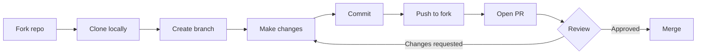
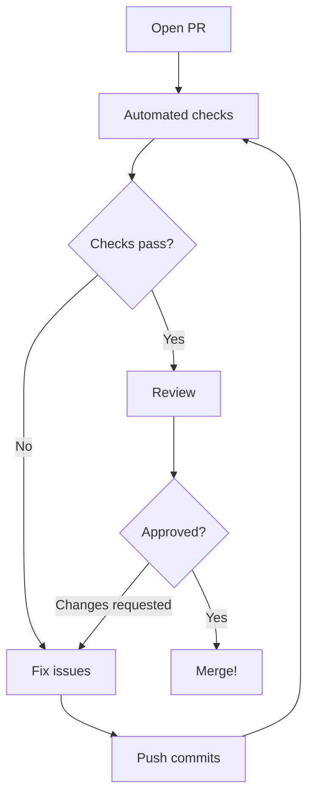
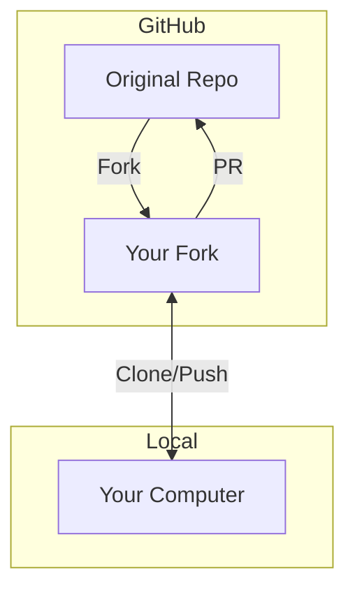

# Git workflow for pull requests

> **Optional reading.** This tutorial explains the fork and pull request workflow used in this assignment. If you're already comfortable with git branching and PRs, you can skip this.

When contributing to someone else's repository, you don't push directly to their repo. Instead, you fork, make changes, and submit a pull request.

---

## The workflow at a glance



---

## Step 1: Fork the repository

Forking creates your own copy of the repository on GitHub.

1. Go to the original repository on GitHub
2. Click the **Fork** button (top right)
3. Select your account as the destination
4. You now have `your-username/security-safari-starter`

```text
Original repo                    Your fork
┌─────────────────────┐          ┌─────────────────────┐
│ instructor/         │   Fork   │ your-username/      │
│ security-safari     │ ───────► │ security-safari     │
└─────────────────────┘          └─────────────────────┘
```

---

## Step 2: Clone your fork

Download your fork to work on it locally.

```bash
# Clone YOUR fork (not the original)
git clone https://github.com/YOUR-USERNAME/security-safari-starter.git

# Enter the project folder
cd security-safari-starter

# Install dependencies
npm install
```

---

## Step 3: Create a branch

Never work directly on `main`. Create a branch for your changes.

```bash
# Create and switch to a new branch
git checkout -b fix-vulnerabilities

# Verify you're on the new branch
git branch
```

Output shows your current branch with an asterisk:

```text
  main
* fix-vulnerabilities
```

### Why use branches?

| Working on main           | Working on a branch        |
| ------------------------- | -------------------------- |
| Mixes your work with base | Keeps changes isolated     |
| Hard to abandon changes   | Easy to start over         |
| Can't work on two things  | Can have multiple branches |
| Messy git history         | Clean, focused commits     |

---

## Step 4: Make your changes

Edit files, fix vulnerabilities, and test your changes.

```bash
# Run the dev server to test
npm run dev

# Check what you changed
git status

# See the actual changes
git diff
```

---

## Step 5: Commit your changes

Save your changes to git with descriptive commit messages.

```bash
# Stage specific files
git add src/index.js src/config.js

# Commit with a clear message
git commit -m "Fix XSS vulnerability by using textContent instead of innerHTML"
```

### Good commit messages

| Bad           | Good                                                    |
| ------------- | ------------------------------------------------------- |
| "fixed stuff" | "Fix XSS vulnerability in comment display"              |
| "changes"     | "Replace eval() with JSON.parse for safer data parsing" |
| "update"      | "Remove hardcoded API key and use environment variable" |

Commit related changes together. Make separate commits for unrelated fixes.

---

## Step 6: Push to your fork

Upload your branch to GitHub.

```bash
# Push your branch to your fork
git push origin fix-vulnerabilities
```

The first push may prompt you to set the upstream:

```bash
git push --set-upstream origin fix-vulnerabilities
```

---

## Step 7: Open a pull request

Create a PR to propose your changes to the original repository.

1. Go to your fork on GitHub
2. Click **"Compare & pull request"** (appears after pushing)
3. Or click **Pull requests** → **New pull request**
4. Set base repository to the **original** repo
5. Set compare to **your branch**
6. Write a clear title and description
7. Click **Create pull request**

```text
base repository: instructor/security-safari  base: main
          ◄────────────────────────────────────────────
head repository: your-username/security-safari  compare: fix-vulnerabilities
```

---

## Step 8: Respond to feedback

After opening a PR:

1. **Automated checks run** — security scan, build preview
2. **Reviewer comments** — may request changes
3. **You push more commits** — same branch, PR updates automatically
4. **Approval and merge** — your changes go into main



---

## Common commands reference

| Task                  | Command                       |
| --------------------- | ----------------------------- |
| Check current branch  | `git branch`                  |
| Create new branch     | `git checkout -b branch-name` |
| Switch branches       | `git checkout branch-name`    |
| See changes           | `git status`                  |
| See line-by-line diff | `git diff`                    |
| Stage files           | `git add file1 file2`         |
| Stage all changes     | `git add .`                   |
| Commit                | `git commit -m "message"`     |
| Push                  | `git push origin branch-name` |
| Pull latest from main | `git pull origin main`        |

---

## Visual summary



---

## Troubleshooting

### "I committed to main by mistake"

Create a branch from your commits, then reset main:

```bash
# Create branch with your commits
git branch fix-vulnerabilities

# Reset main to match origin
git checkout main
git reset --hard origin/main

# Switch to your branch
git checkout fix-vulnerabilities
```

### "My branch is behind main"

Update your branch with the latest changes:

```bash
# Get latest from original repo
git fetch origin

# Merge main into your branch
git merge origin/main
```

### "I want to start over"

Delete your branch and create a fresh one:

```bash
git checkout main
git branch -D fix-vulnerabilities
git checkout -b fix-vulnerabilities
```

---

## Learn more

- [GitHub: About pull requests](https://docs.github.com/en/pull-requests/collaborating-with-pull-requests/proposing-changes-to-your-work-with-pull-requests/about-pull-requests)
- [GitHub: Creating a pull request from a fork](https://docs.github.com/en/pull-requests/collaborating-with-pull-requests/proposing-changes-to-your-work-with-pull-requests/creating-a-pull-request-from-a-fork)
- [Atlassian: Git branching](https://www.atlassian.com/git/tutorials/using-branches)
