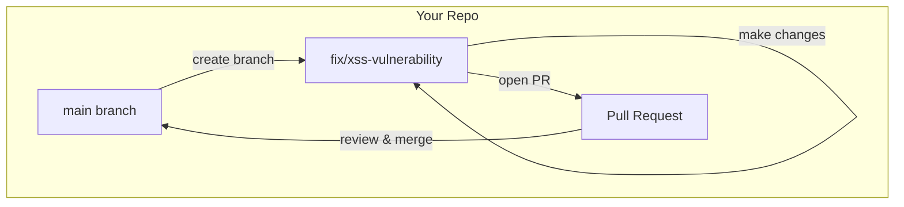
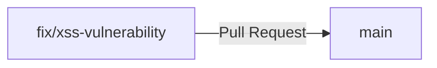
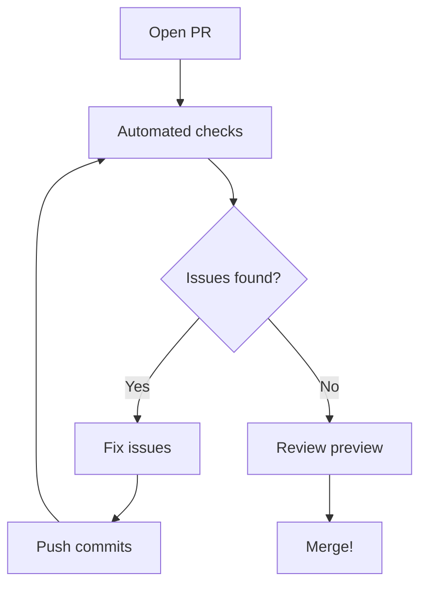
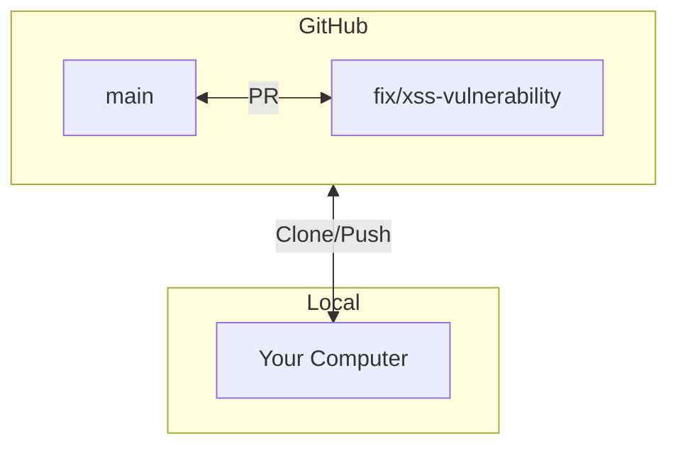

# Git workflow for pull requests

GitHub Classroom created this repository for you. You are the **admin and sole collaborator** — you have full control and could push directly to `main` if you wanted.

> [!WARNING]
> **But do not do that!** Use branches and pull requests instead.

---

## Why use branches and PRs in your own repo?

You could commit everything straight to `main`. It would work. But this assignment is practice for contributing to open source projects, where you **can't** push to main — you must use branches and pull requests.

By using the branch → PR workflow now, you'll:

- **Get comfortable with git branching** before it's required
- **See deploy previews** of your changes before merging
- **Trigger automated security checks** that comment on your PR
- **Build good habits** for professional development



---

## The workflow

**Repeat this for each vulnerability (5 times):**

1. **Create a branch** for one fix (e.g., `fix/xss-vulnerability`)
2. **Make changes** and commit them
3. **Push** your branch to GitHub
4. **Open a PR** from your branch to main
5. **Review** the automated checks and deploy preview
6. **Merge** your PR
7. **Switch back to main** and pull before starting the next fix

---

## Step 0: Deploy to Netlify first

Before creating any PRs, deploy your site to Netlify so you get deploy previews. Use site name: `security-safari-YOUR-USERNAME`

---

## Step 1: Clone your repo

Download your repository to work on it locally.

```bash
# Clone your repo
git clone https://github.com/YOUR-USERNAME/security-safari-YOUR-USERNAME.git

# Enter the project folder
cd security-safari-YOUR-USERNAME

# Install dependencies
npm install
```

---

## Step 2: Create a branch

Never work directly on `main`. Create a branch for each fix using the `fix/` prefix.

```bash
# Create and switch to a new branch
git checkout -b fix/xss-vulnerability

# Verify you're on the new branch
git branch
```

### Branch naming convention

Create a **separate branch for each vulnerability** you fix:

| Vulnerability       | Branch name               |
| ------------------- | ------------------------- |
| innerHTML XSS       | `fix/xss-vulnerability`   |
| eval() injection    | `fix/eval-injection`      |
| Hardcoded secret    | `fix/hardcoded-secret`    |
| Outdated dependency | `fix/outdated-dependency` |
| Secret in history   | `fix/secret-in-history`   |

This gives you practice with branching and creates clear git history.

Output shows your current branch with an asterisk:

```text
  main
* fix/xss-vulnerability
```

### Why use branches?

| Working on main           | Working on a branch        |
| ------------------------- | -------------------------- |
| Mixes your work with base | Keeps changes isolated     |
| Hard to abandon changes   | Easy to start over         |
| Can't work on two things  | Can have multiple branches |
| Messy git history         | Clean, focused commits     |

---

## Step 3: Make your changes

Edit files, fix vulnerabilities, and test your changes.

```bash
# Run the dev server to test
npm run dev

# Check what you changed
git status

# See the actual changes
git diff
```

---

## Step 4: Commit your changes

Save your changes to git with descriptive commit messages.

```bash
# Stage specific files
git add src/index.js src/config.js

# Commit with a clear message
git commit -m "Fix XSS vulnerability by using textContent instead of innerHTML"
```

### Good commit messages

| Bad           | Good                                                    |
| ------------- | ------------------------------------------------------- |
| "fixed stuff" | "Fix XSS vulnerability in comment display"              |
| "changes"     | "Replace eval() with JSON.parse for safer data parsing" |
| "update"      | "Remove hardcoded API key and use environment variable" |

Commit related changes together. Make separate commits for unrelated fixes.

---

## Step 5: Push your branch

Upload your branch to GitHub.

```bash
# Push your branch
git push origin fix/xss-vulnerability
```

The first push may prompt you to set the upstream:

```bash
git push --set-upstream origin fix/xss-vulnerability
```

---

## Step 6: Open a pull request

Create a PR to merge your branch into main.

1. Go to your repo on GitHub
2. Click **"Compare & pull request"** (appears after pushing)
3. Or click **Pull requests** → **New pull request**
4. Set base to **main**
5. Set compare to **your branch** (fix/xss-vulnerability)
6. Write a clear title and description
7. Click **Create pull request**



---

## Step 7: Review and merge

After opening a PR:

1. **Automated checks run** — security scan posts a comment, Netlify builds a preview
2. **Review the results** — click the deploy preview link to see your changes live
3. **Fix any issues** — push more commits to the same branch, PR updates automatically
4. **Merge** — when you're satisfied, click "Merge pull request"



---

## Common commands reference

| Task                  | Command                       |
| --------------------- | ----------------------------- |
| Check current branch  | `git branch`                  |
| Create new branch     | `git checkout -b branch-name` |
| Switch branches       | `git checkout branch-name`    |
| See changes           | `git status`                  |
| See line-by-line diff | `git diff`                    |
| Stage files           | `git add file1 file2`         |
| Stage all changes     | `git add .`                   |
| Commit                | `git commit -m "message"`     |
| Push                  | `git push origin branch-name` |
| Pull latest from main | `git pull origin main`        |

---

## Visual summary



---

## Troubleshooting

### "I committed to main by mistake"

Create a branch from your commits, then reset main:

```bash
# Create branch with your commits
git branch fix/xss-vulnerability

# Reset main to match origin
git checkout main
git reset --hard origin/main

# Switch to your branch
git checkout fix/xss-vulnerability
```

### "My branch is behind main"

Update your branch with the latest changes:

```bash
# Get latest from GitHub
git fetch origin

# Merge main into your branch
git merge origin/main
```

### "I want to start over"

Delete your branch and create a fresh one:

```bash
git checkout main
git branch -D fix/xss-vulnerability
git checkout -b fix/xss-vulnerability
```

---

## Learn more

- [GitHub: About pull requests](https://docs.github.com/en/pull-requests/collaborating-with-pull-requests/proposing-changes-to-your-work-with-pull-requests/about-pull-requests)
- [GitHub: Creating a pull request](https://docs.github.com/en/pull-requests/collaborating-with-pull-requests/proposing-changes-to-your-work-with-pull-requests/creating-a-pull-request)
- [Atlassian: Git branching](https://www.atlassian.com/git/tutorials/using-branches)
