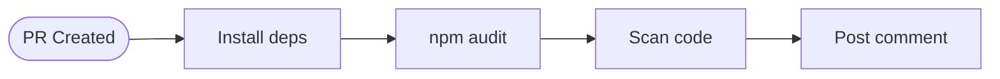
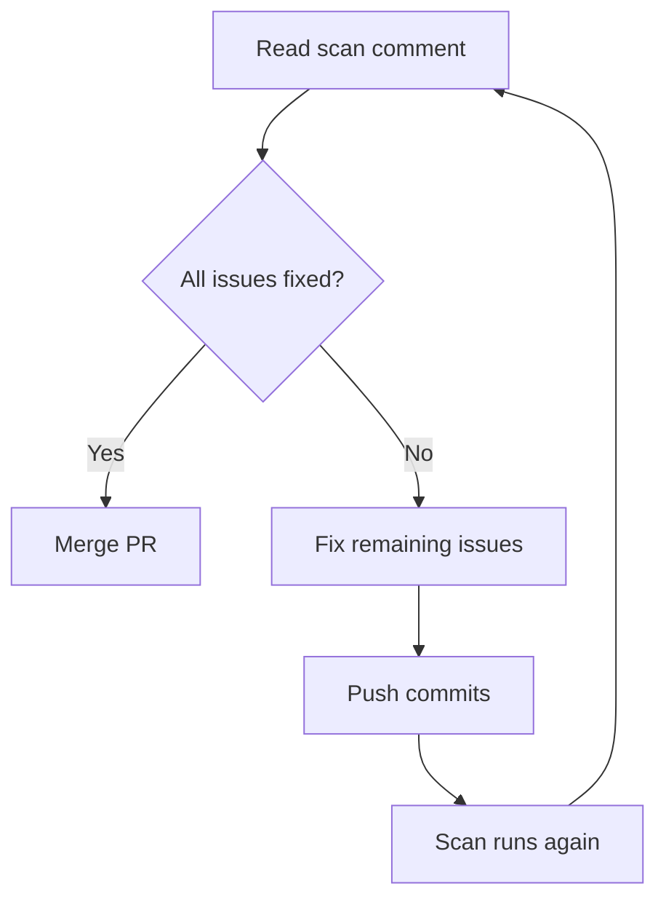

# Introduction to GitHub Actions

> **Optional reading.** This tutorial explains the automated checks that run when you submit a pull request. You don't need to understand GitHub Actions to complete the assignment — just know that your PR gets automatically scanned for security issues.

GitHub Actions is a CI/CD (Continuous Integration/Continuous Deployment) platform built into GitHub. It automatically runs tasks when certain events happen in your repository.

---

## What are GitHub Actions?

When you push code or open a pull request, GitHub can automatically:

- Run tests
- Check code quality
- Scan for security issues
- Build and deploy your application

These automated checks help catch problems before code is merged.

---

## Why this matters for security

Many security vulnerabilities slip into production because no one checked. GitHub Actions can automate security scanning so every PR gets reviewed — even if humans miss something.

Common security checks in real projects:

| Check             | What it catches                           |
| ----------------- | ----------------------------------------- |
| `npm audit`       | Known vulnerabilities in dependencies     |
| Secret scanning   | Accidentally committed API keys           |
| Static analysis   | Dangerous code patterns (eval, innerHTML) |
| Dependency review | New dependencies with issues              |

---

## How it works in this project

When you create a pull request, a workflow automatically runs and:

1. Installs your dependencies
2. Runs `npm audit` to check for vulnerable packages
3. Scans for `innerHTML` usage (XSS risk)
4. Scans for `eval()` usage (code injection risk)
5. Checks for hardcoded secrets
6. Posts a comment on your PR with results



You'll see a comment like:

```
## Security Scan Results

🔍 2 issue(s) remaining, 2 fixed

See the workflow run for details.
```

This helps you verify your fixes are working before the PR is reviewed.

---

## Anatomy of a workflow file

Workflows live in `.github/workflows/` as YAML files. Here's the structure:

```yaml
name: Security Check # Name shown in GitHub UI

on: # When to run
  pull_request:
    branches: [main] # Only PRs targeting main

jobs: # What to do
  security-scan:
    runs-on: ubuntu-latest # Use a Linux runner

    steps: # Individual tasks
      - name: Checkout code
        uses: actions/checkout@v4

      - name: Run security checks
        run: npm audit
```

Key concepts:

| Term      | Meaning                                                       |
| --------- | ------------------------------------------------------------- |
| `on`      | The trigger event (push, pull_request, schedule)              |
| `jobs`    | Groups of steps that run together                             |
| `runs-on` | The environment (ubuntu-latest, windows-latest, macos-latest) |
| `steps`   | Individual commands or actions                                |
| `uses`    | A pre-built action from the marketplace                       |
| `run`     | A shell command to execute                                    |

---

## Viewing workflow results

After opening a PR, you'll see:

1. **Status checks** at the bottom of the PR — green checkmark or red X
2. **A comment** posted by the workflow with your results
3. **Details link** to see the full output in the Actions tab

Click "Details" next to a check to see:

- Each step that ran
- Full output and logs
- Any errors that occurred

---

## The security check in this project

The workflow file is at `.github/workflows/security-check.yml`. It checks for the "Big Five" vulnerabilities:

| Vulnerability     | How it's detected                         |
| ----------------- | ----------------------------------------- |
| Outdated Vite     | `npm audit`                               |
| innerHTML XSS     | `grep innerHTML src/`                     |
| eval() injection  | `grep eval( src/`                         |
| Hardcoded secrets | Pattern matching for `sk_live`, `API_KEY` |

The workflow **doesn't block your PR** — it just reports findings. You can still merge even if issues remain (though you shouldn't!).

---

## Using the feedback

When you see the security scan comment:

1. **Check which issues are fixed** — verify your changes worked
2. **Check which issues remain** — you might have missed something
3. **Click the workflow link** — see detailed output for each check
4. **Push more commits** — the workflow runs again automatically



Each push to your PR branch triggers a new scan, so you can iterate until all checks pass.

---

## Why automated checks matter

In professional development:

- **No code ships without checks** — CI/CD is standard practice
- **Security scanning is automated** — humans miss things
- **Fast feedback** — know about problems in minutes, not days
- **Consistency** — every PR gets the same scrutiny

Learning to work with CI/CD pipelines is an essential developer skill.

---

## Learn more

- [GitHub Actions documentation](https://docs.github.com/en/actions)
- [Understanding GitHub Actions](https://docs.github.com/en/actions/learn-github-actions/understanding-github-actions)
- [Workflow syntax reference](https://docs.github.com/en/actions/reference/workflow-syntax-for-github-actions)
