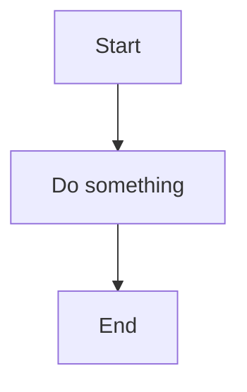
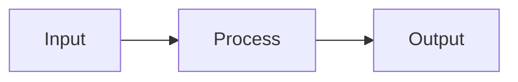
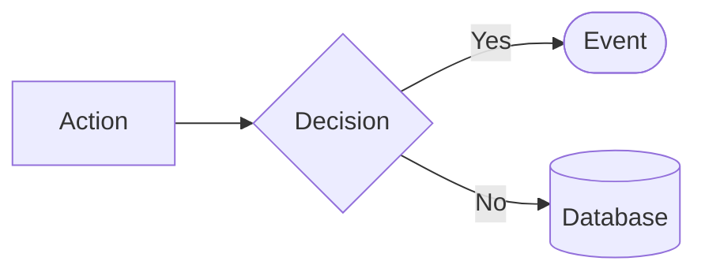
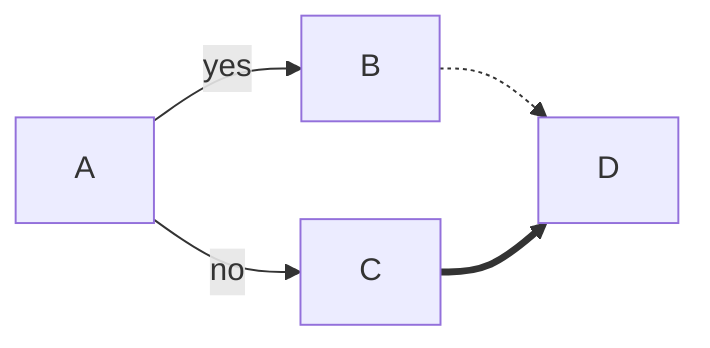
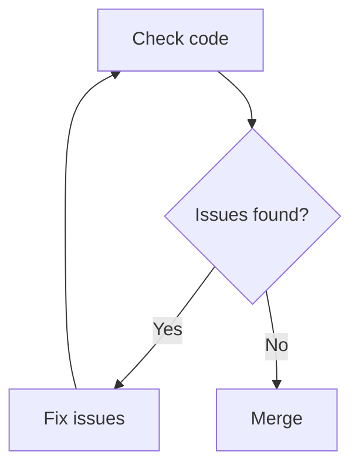
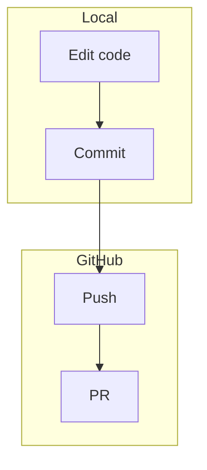
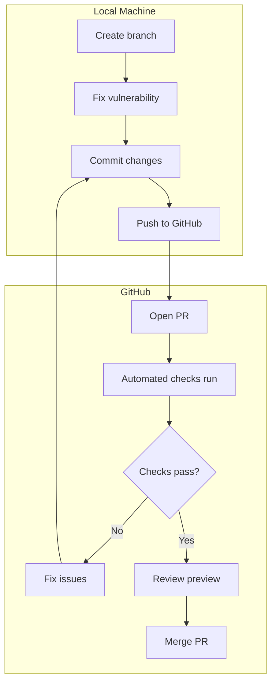

# Mermaid diagrams in Markdown

You know how to draw flowcharts. Mermaid lets you write them as text — no drawing tools needed.

---

## What is Mermaid?

Mermaid is a text-based diagramming language. Instead of dragging shapes, you describe the diagram in code.

**GitHub renders Mermaid automatically.** When you push a Markdown file with a Mermaid code block, GitHub shows the diagram.

---

## Basic flowchart syntax

Wrap your diagram in a code block with `mermaid` as the language:

````markdown

````

This renders as:


---

## Direction

Control flow direction with two letters after `flowchart`:

| Code | Direction     | Use for                  |
| ---- | ------------- | ------------------------ |
| `TD` | Top to down   | Process flows, timelines |
| `TB` | Top to bottom | Same as TD               |
| `LR` | Left to right | Pipelines, sequences     |
| `RL` | Right to left | Reverse flows            |



---

## Node shapes

Different brackets create different shapes:

| Syntax     | Shape        | Use for          |
| ---------- | ------------ | ---------------- |
| `[text]`   | Rectangle    | Actions, steps   |
| `(text)`   | Rounded rect | Start/end points |
| `{text}`   | Diamond      | Decisions        |
| `([text])` | Stadium/pill | Events           |
| `[[text]]` | Subroutine   | Subprocess       |
| `[(text)]` | Cylinder     | Database         |



---

## Arrows and labels

| Syntax      | Arrow type       |
| ----------- | ---------------- | --- | ---------------- |
| `-->`       | Solid arrow      |
| `---`       | Solid line       |
| `-.->`      | Dotted arrow     |
| `==>`       | Thick arrow      |
| `--text-->` | Arrow with label |
| `-->        | text             | `   | Arrow with label |



---

## Decisions (branching)

Use diamond shapes `{}` for yes/no decisions:



---

## Subgraphs (grouping)

Group related nodes with `subgraph`:



---

## Real example: PR workflow

Here's the workflow you follow in this project:



---

## VS Code extension

GitHub renders Mermaid automatically, but to preview locally in VS Code:

1. Open VS Code Extensions (Ctrl+Shift+X / Cmd+Shift+X)
2. Search for **"Markdown Preview Mermaid Support"**
3. Install the extension by Matt Bierner
4. Open any Markdown file and press Ctrl+Shift+V (Cmd+Shift+V on Mac) to preview

The extension renders Mermaid diagrams in the Markdown preview pane.

---

## Common mistakes

### Wrong: Spaces in node IDs

```text
My Node[Label]  ❌ Node ID can't have spaces
MyNode[Label]   ✅ Use camelCase or underscores
```

### Wrong: Missing direction

```text
flowchart        ❌ Needs direction
flowchart TD     ✅ Top to down
```

### Wrong: Forgetting code fence

````text
flowchart TD     ❌ Not in code block
A --> B

```mermaid         ✅ Proper code block
flowchart TD
A --> B
```                (close with ```)
````

---

## Quick reference

```text
flowchart TD          Direction: TD, TB, LR, RL
    A[Rectangle]      Square brackets = box
    B(Rounded)        Parentheses = rounded
    C{Diamond}        Braces = decision
    A --> B           Arrow
    B -->|label| C    Arrow with text
    subgraph Name     Group nodes
        ...
    end
```

---

## Learn more

- [Mermaid documentation](https://mermaid.js.org/syntax/flowchart.html)
- [Mermaid live editor](https://mermaid.live/) — test diagrams in your browser
- [GitHub Mermaid support](https://docs.github.com/en/get-started/writing-on-github/working-with-advanced-formatting/creating-diagrams)
