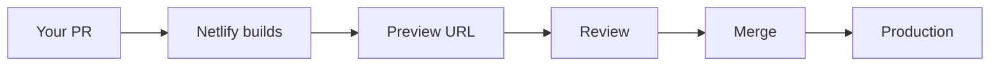
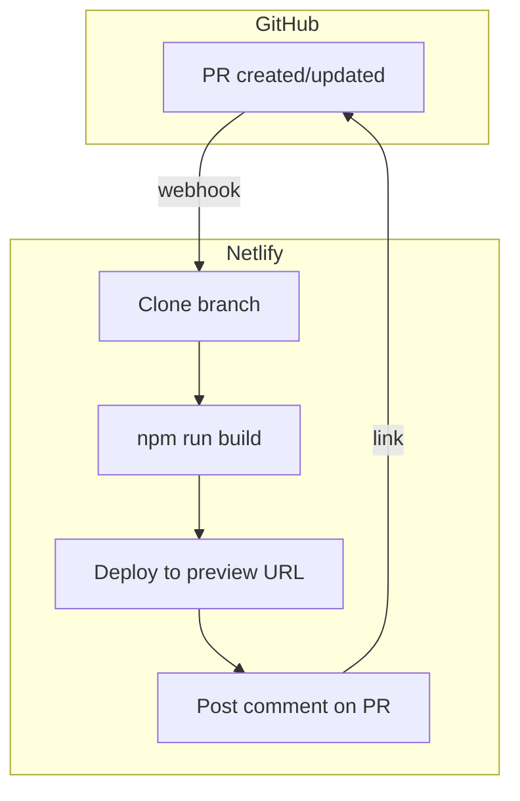

# Netlify deploy previews

When you create a pull request, Netlify builds and deploys a preview of your changes. This lets you see your fixes in action before merging.

---

## Before you start: Deploy to Netlify

> [!IMPORTANT]
> Deploy your site to Netlify **before** creating your first PR, or you won't get deploy previews.

Use a unique site name: `security-safari-YOUR-USERNAME`

---

## What happens when you submit a PR

1. **You push your branch** and create a pull request on GitHub
2. **Netlify detects the PR** and starts building your version of the site
3. **A preview URL appears** in the PR comments (like `deploy-preview-42--security-safari.netlify.app`)
4. **Reviewers click the link** to see your changes live
5. **After merge**, your changes go to the main site



---

## Finding your preview link

In your pull request on GitHub, look for the Netlify bot comment:

```text
✅ Deploy Preview for security-safari ready!

🔨 Explore the source changes: [commit abc123]
🔍 Inspect the deploy log: [logs]
😎 Browse the preview: https://deploy-preview-42--security-safari.netlify.app
```

Click "Browse the preview" to see your changes live.

---

## Why previews matter

Deploy previews solve a common problem: "It works on my machine."

| Without previews            | With previews            |
| --------------------------- | ------------------------ |
| Reviewer clones your branch | Reviewer clicks a link   |
| Reviewer runs `npm install` | Preview is already built |
| Reviewer runs `npm run dev` | No setup needed          |
| Takes 5-10 minutes          | Takes 5 seconds          |

Reviewers can verify your fixes work without any local setup.

---

## Preview vs production

| Environment | URL                                              | When updated                 |
| ----------- | ------------------------------------------------ | ---------------------------- |
| Preview     | `deploy-preview-XX--security-safari.netlify.app` | Every push to your PR branch |
| Production  | `security-safari.netlify.app`                    | When PR is merged to main    |

Each PR gets its own unique preview URL. Push more commits to your branch, and the preview updates automatically.

---

## Common questions

### Why is my preview still building?

Builds typically take 30-60 seconds. Look for the yellow "pending" status check on your PR.

### Why does my preview show an error?

The build failed. Check the Netlify deploy log (linked in the PR comment) to see what went wrong. Common causes:

- JavaScript syntax errors
- Missing dependencies
- Build script errors

### Can I share my preview link?

Yes! Preview links are public. Share them with classmates to demonstrate your fixes before they're merged.

### How long do previews last?

Previews stay active while the PR is open. After merge or close, they may be removed after some time.

---

## How it works (technical)

Netlify integrates with GitHub through webhooks:

1. GitHub notifies Netlify when a PR is created or updated
2. Netlify clones your branch and runs `npm run build`
3. Netlify deploys the built files to a unique URL
4. Netlify posts the preview link as a PR comment



This is called **continuous deployment** — every code change triggers an automatic build and deploy.

---

## What you need to know

For this assignment:

- Your PR automatically gets a preview — no action needed
- Click the preview link to verify your fixes work
- If the build fails, check the deploy log for errors
- Reviewers will use the preview to verify your security fixes
